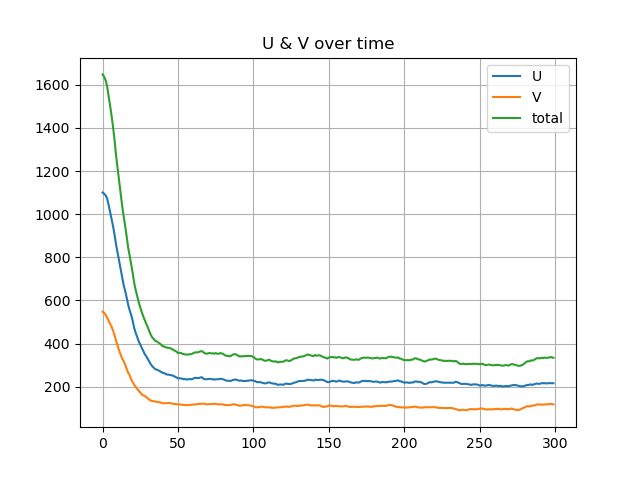
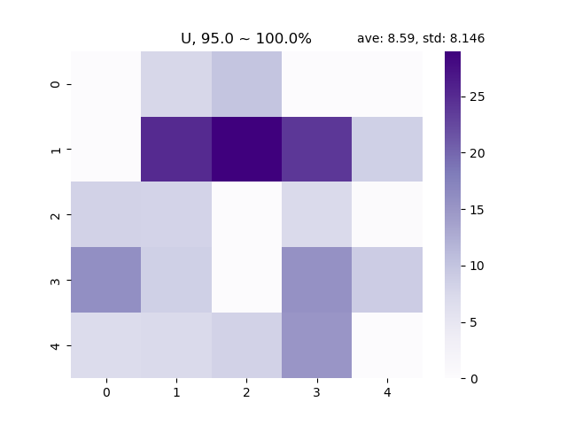
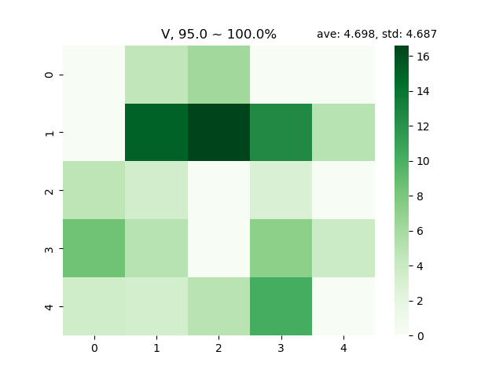

.. _Minimal_Usage:

Minimal Usage
================

This section provides a minimal usage of the ``piegy`` package.

.. line-block::
    This short demo uses the following ``piegy`` modules:

.. code-block:: python

    import piegy.model as model
    import piegy.figures as figures
    import piegy.videos as videos
    from piegy.data_tools import save_data, read_data

We first define the parameters of our model: spatial dimension, payoff matrices, boundary conditions, etc.
We use U to denote preys, V to predators.

.. code-block:: python

    N = 5               # Number of rows
    M = 5               # Number of cols
    maxtime = 300       # how long you want the model to run
    record_itv = 0.1    # how often to record data.
    sim_time = 5        # repeat the simulation 5 times
    boundary = True     # zero-flux boundary condition.

    # initial population for the N x M patches. 
    I = [[[44, 22] for _ in range(M)] for _ in range(N)]
    
    # flattened payoff matrices
    X = [[[-0.1, 0.4, 0, 0.2] for _ in range(M)] for _ in range(N)]
    
    # patch variables
    P = [[[0.5, 0.5, 200, 200, 0.001, 0.001] for _ in range(M)] for _ in range(N)]

    # seed for random numbers
    seed = 36

.. line-block::
    Then use these parameters to initialize a ``piegy.model.simulation`` object:

.. code-block:: python

    sim = model.simulation(N, M, maxtime, record_itv, sim_time, boundary, I, X, P, seed = seed)

.. line-block::
    To run the simulation, call ``piegy.model.run`` with the ``sim`` object we just created. Data generated during the simulation will be stored in ``sim``.

.. code-block:: python

    model.run(sim)

.. line-block::
    This might take a while. You can see how much runtime it took after simulation is done.

    Once the simulation completes, we can analyze the results with a wide range of tools provided by our ``piegy`` package. For example, use a simple curve to show population dynamics:

.. code-block:: python

    fig1 = figures.UV_dyna(sim, interval = 10)

.. line-block::
    You can see the following figure immediately if using a notebook:

    Population Dynamics

.. line-block::
    Or you can save and view in your file system if using regular ``.py`` script:

.. code-block:: python

    fig1.savefig('UV_dynamics.png')

.. line-block::
    We notice the populations quickly decrease to a near-zero equilibrium -- something interesting must have happened. Let's see more by the population distribution heatmaps:

.. code-block:: python

    fig2, fig3 = figures.UV_heatmap(sim, start = 0.95, end = 1.0)

.. line-block::
    You can save it as well by

.. code-block:: python

    fig2.savefig('U_heatmap.png')
    fig3.savefig('V_heatmap.png')

.. line-block::
    This gives the following population distribution:

    Distribution of U at 95% ~ 100% maxtime

    Distribution of V at 95% ~ 100% maxtime

"95.0% ~ 100.0%" means we are making heatmaps with average data generated at the last 5% of ``maxtime``.

This is interesting phenomenon: U, V start from uniform distribution, but ended up with clustering bahevior.
We can also see how population distribution change over time directly by making videos:

.. code-block:: python

    videos.make_video(sim, 'UV_heatmap', dirs = 'demo video')

.. line-block::
    Then two demo videos will be made and saved at ``./demo video``. Check them out!

.. line-block::
    For large simulations, it would be very helpful to save data so that we don't need to run the entire simulation again. You can save data by:

.. code-block:: python

    save_data(sim, dirs = 'demo save')

.. line-block::
    All the paramters and data will be stored in ``./demo save``.
    You can retrieve them by ``read_data``:

.. code-block:: python

    sim2 = read_data('demo save')

``sim2`` will be exactly the same as ``sim`` with the same parameters and data.

Here this short demo is coming to an end. We have shown how to set up a model and run simulations, basic figures and videos, and ways to save and read data. 
You can find more detailed examples in the documentation of every module.

